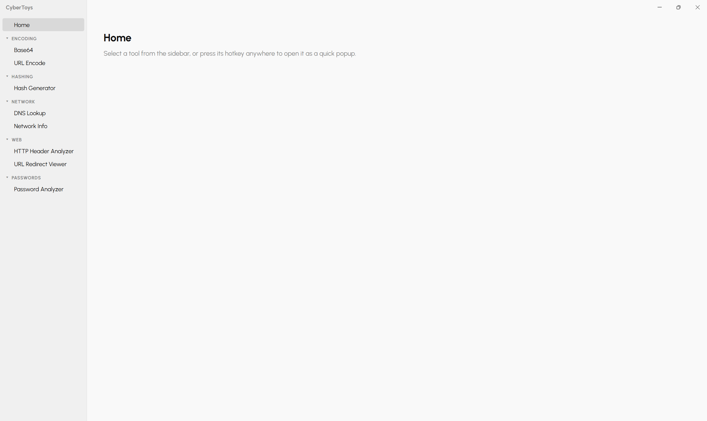
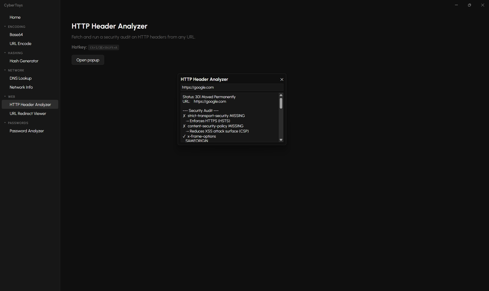

<div align="center">


# CyberToys

A collection of cybersecurity tools.

[](./LICENSE)


</div>

## 🧰 Tools

### Encoding

| Tool | Description |
| - | - |
| Base64 | Encode or decode Base64 strings. |
| URL | URL-encode or decode strings. |

### Hashing

| Tool | Description |
| - | - |
| Hash Generator | Generate SHA256, SHA1, or MD5 hashes from text. |

### Network

| Tool | Description |
| - | - |
| DNS Lookup | Resolve A, AAAA, MX, NS, TXT, and CNAME records for any domain. |
| Network Info | Display local network interfaces, IPs, and MACs. |

### Web

| Tool | Description |
| - | - |
| HTTP Header Analyzer | Fetch HTTP headers and audit them for common security issues. |
| URL Redirect Viewer | Follow a URL through its full redirect chain. |

### Passwords

| Tool | Description |
| - | - |
| Password Analyzer | Analyze password strength and generate strong passwords. |

## 📦 Built With

| Tool | Purpose |
| - | - |
| Electron Forge | Handles packaging and creating installers |

## 📸 Preview

<div style="display: flex; gap: 10px; justify-content: center">
    
    
</div>

## 🚀 Installation

> Packaged installers are coming.

### Requirements

- [Node.js](https://nodejs.org) (v18+)

### Clone the Repository and Run

```
git clone https://github.com/johnarp/cybertoys.git
cd cybertoys
npm install
npm start
```

## 🗺️ Roadmap

### General

- Installation
- Running in the background
- Better tool organization in README
- Better tool management in the tools folder
- Allow resizing of pop up windows
- Allow zoom in/out

### New Tools

- Keylogger
- Vulnerability scanner
- Metadata scrubber
- Network traffic analyzer
- Steganography
- MAC spoofing and ARP detection
- Security news scraper
- SSH brute force detector
- Wireless deauth detector
- Credential rotation enforcer
- Cryptographic algorithm encrypter/decrypter/cracker
- Suspicious filename detector
- Traceroute visualizer
- Packet sniffer
- Hash Cracker
- Port Scanner
- SSL Certifiate Checker

## 📜 Disclaimer

CyberToys is intended for educational purposes and authorized use only.

Only use these tools against systems and networks you own or have explicit written permission to test. Unauthorized port scanning, traffic analysis, or any other form of network probing may be illegal in your jurisdiction and is not condoned by this project.

The author assumes no liability for any misuse or damage caused by this software. Use responsibly.

## 📄 License

This project is licensed under the [MIT License](./LICENSE).